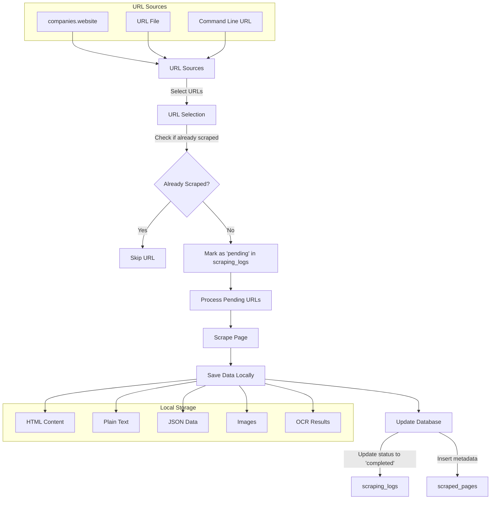

# Database Structure and Data Flow Analysis

## 1. Database Structure Implementation

The project uses three main database tables as specified in implementation_notes.md:

1. **`companies` Table**:
   - Contains company information including website URLs
   - Key columns include:
     - `client_id`
     - `company_name`
     - `website`
     - `number_of_retail_locations`
     - `founded_year`
     - `employees`
     - `created_at`
     - `updated_at`
     - `industry`
     - `annual_revenue`
     - `short_description`
     - `keywords`
     - `technologies`
     - `street`
     - `city`
     - `state`
     - `postal_code`
     - `country`
     - `address`
     - `apollo_account_id`
     - `seo_description`
     - `company_phone`
     - `linkedin_url`
     - `facebook_url`
     - `twitter_url`
   - The `website` column is used as the source for URLs to scrape

2. **`scraped_pages` Table**:
   - Stores metadata about scraped pages
   - Includes columns like `page_id`, `client_id`, `url`, `page_type`, `scraped_at`, `raw_html_path`, `plain_text_path`, `summary`, and `extraction_notes`
   - Used to track which pages have been scraped and where the scraped data is stored

3. **`scraping_logs` Table**:
   - Tracks the scraping process status for each URL
   - Includes columns like `log_id`, `client_id`, `source`, `url_scraped`, `status`, `scraping_date`, and `error_message`
   - The `status` column can be 'pending', 'completed', or 'failed'

## 2. Data Flow Analysis

The data flow in the web scraping project follows these steps:

### Step 1: URL Selection
- URLs can be selected from multiple sources:
  - From the `companies.website` column using `fetch_urls_from_db` function
  - From a file using `--url-file` argument
  - Directly providing a URL via command line

### Step 2: URL Processing and Status Tracking
- Each URL is checked against `scraping_logs` to avoid rescraping already completed URLs
- Selected URLs are marked as 'pending' in the `scraping_logs` table
- The `process_pending_urls_loop.py` script (in `src/scripts/`) fetches URLs marked as 'pending' and processes them

### Step 3: Scraping Process
- The `scrape_page` function in `src/scraper_app/scraper.py` handles the actual scraping:
  - Validates the URL
  - Initializes a browser using Playwright
  - Extracts HTML content and visible text
  - Downloads and processes images
  - Performs OCR on images if required
  - Saves all data locally in the specified directory structure

### Step 4: Local Data Storage
- HTML content is saved to `data/scraping/<timestamp>/pages/<company_name>/page.html`
- Plain text is saved to `data/scraping/<timestamp>/pages/<company_name>/text.txt`
- JSON data is saved to `data/scraping/<timestamp>/pages/<company_name>/text.json`
- Images are saved to `data/scraping/<timestamp>/images/<company_name>/`
- OCR results are saved to `data/scraping/<timestamp>/pages/<company_name>/ocr/summary.json`

### Step 5: Database Updates
- After scraping, the status is updated to 'completed' or 'failed' in `scraping_logs`
- Metadata about the scraped page is stored in `scraped_pages`

## 3. Comparison with Requirements

Let me compare the current implementation with the requirements specified in implementation_notes.md:

### Dynamic URL Selection (Step 2 in requirements)
- **Requirement**: Select URLs dynamically from `companies.website` SQL table column
- **Implementation**: The `fetch_urls_from_db` function in `src/scraper_app/db_utils.py` selects URLs from the `companies.website` column
- **Status**: ✅ Implemented

### Specifying Number of URLs to Scrape
- **Requirement**: Allow specifying how many URLs to scrape per run
- **Implementation**: The `--num-urls` argument allows specifying the number of URLs to fetch from the database
- **Status**: ✅ Implemented

### Avoiding Rescraping
- **Requirement**: Check `scraping_logs` to avoid rescraping URLs already completed successfully
- **Implementation**: The `check_url_scraped` function checks if a URL has already been scraped with 'completed' status
- **Status**: ✅ Implemented

### Status Tracking
- **Requirement**: Mark each scrape clearly ('pending', 'completed', 'failed')
- **Implementation**: URLs are marked as 'pending' in `log_pending_scrape`, and updated to 'completed' or 'failed' in `update_scraping_log_status`
- **Status**: ✅ Implemented

### Scraping Process (Step 3 in requirements)
- **Requirement**: Scrape HTML content and images, extract plain text
- **Implementation**: The `scrape_page` function in `src/scraper_app/scraper.py` handles all these tasks
- **Status**: ✅ Implemented

### Local Data Storage
- **Requirement**: Save data locally in specified directory structure
- **Implementation**: The `get_formatted_output_paths` function creates the required directory structure, and files are saved in the appropriate locations
- **Status**: ✅ Implemented

### Database Updates
- **Requirement**: Update `scraping_logs` and `scraped_pages` tables
- **Implementation**: The `update_scraping_log_status` and `insert_scraped_page_data` functions update these tables
- **Status**: ✅ Implemented

## 4. Identified Gaps and Issues

While the implementation generally aligns with the requirements, there are a few potential issues:

1. **Simulated Scraping in src/scraper_app/main.py**: The src/scraper_app/main.py file contains comments indicating that the actual scraping process is "out of scope for this task" and is being simulated. This suggests that the integration between URL selection and the actual scraping process might not be fully implemented.

2. **Error Handling**: While there is error handling in place, it might be beneficial to add more robust error handling and retry mechanisms for failed scrapes.

3. **Logging and Monitoring**: The current implementation includes logging, but it might be useful to add more comprehensive monitoring and reporting capabilities.

4. **Scalability**: The current implementation might face scalability issues when dealing with a large number of URLs. Consider implementing batch processing or parallel scraping to improve performance.

## 5. Data Flow Diagram

## 6. Conclusion

The current implementation of the web scraping project generally aligns with the requirements specified in implementation_notes.md. The database structure and data flow are well-designed, with clear separation of concerns and appropriate error handling.

The code supports dynamic URL selection from the `companies.website` column, avoids rescraping already completed URLs, and properly tracks the status of each scrape. The scraping process itself is comprehensive, handling HTML content, text extraction, image processing, and OCR.

However, there are some areas for improvement, particularly in terms of integration between URL selection and the actual scraping process, error handling, monitoring, and scalability.